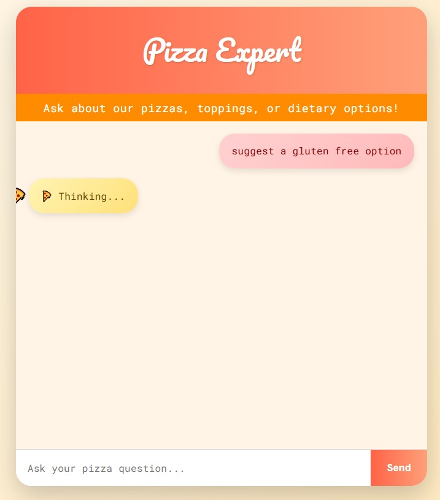

# RAG-Pizza-Chatbot-LangChain-Ollama

An **AI-powered pizza recommendation chatbot** leveraging **Retrieval-Augmented Generation (RAG)** to provide context-aware, dietary-sensitive suggestions from real restaurant reviews.

---
## Table of Contents
- [Overview](#overview)
- [Workflow](#workflow)
- [Dataset](#dataset)
- [Tech Stack](#tech-stack)
- [Chat Demo](#chat-demo)
- [Usage](#usage)
- [License](#license)

---

## Overview
This project demonstrates a **local RAG workflow** using LangChain and Ollama embeddings.  
User queries are matched with relevant restaurant reviews from a **local Chroma vector database**, and responses are generated using a **large language model (LLM)** to provide natural, context-aware recommendations.

---

## Workflow
1. **Data Preparation**  
   - Load `realistic_restaurant_reviews.csv` using **Pandas**  
   - Convert each review into a **LangChain `Document`** with metadata (`Rating`, `Date`)  

2. **Vector Embeddings & Storage**  
   - Generate vector embeddings with **OllamaEmbeddings (`mxbai-embed-large`)**  
   - Store vectors in a **Chroma local vector database** for fast similarity search  

3. **Retrieval-Augmented Generation (RAG)**  
   - User questions are sent to the **Chroma retriever**  
   - The retriever returns the top **k most relevant reviews**  
   - Reviews are passed into **OllamaLLM via LangChain**  
   - LLM generates **human-like, context-aware answers** referencing actual reviews  

4. **Frontend (Minimal)**  
   - Web interface for interactive queries  
   - Displays user questions and LLM-generated responses  

---

## Dataset
- CSV: `realistic_restaurant_reviews.csv`  
- Fields: `Title`, `Review`, `Rating`, `Date`  
- Serves as the knowledge base for retrieval and RAG generation  

---

## Tech Stack
- **AI / Backend:** Python, LangChain, Ollama embeddings, Chroma, Pandas, Flask  
- **Frontend:** HTML, CSS, JavaScript (minimal, interactive chat UI)  
- **Workflow:** Local RAG with document retrieval and LLM-based response generation  

---

## Chat Demo

| User Query | Bot Response |
|------------|--------------|
|  |  |

---
